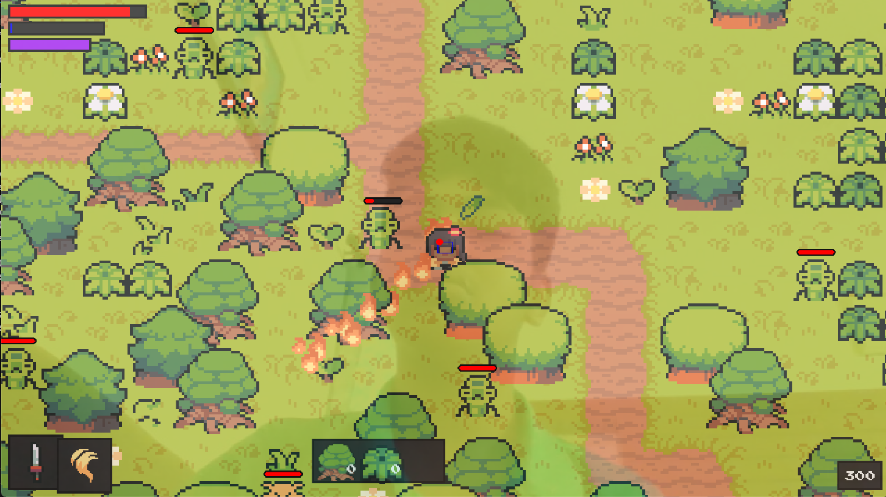

## What is this?

This is a zelda styles game created with pygame.
Movement of the player can be done with camera itself. Moving the face moves the player.

### Here's a pic of the game.

## Movement instructions

- Make a fist - lock movement
- Index finger up - Move
- Thumb finger out - Attack
- Index + Thumb finger out - Move + attack
- Open palm - Magic
