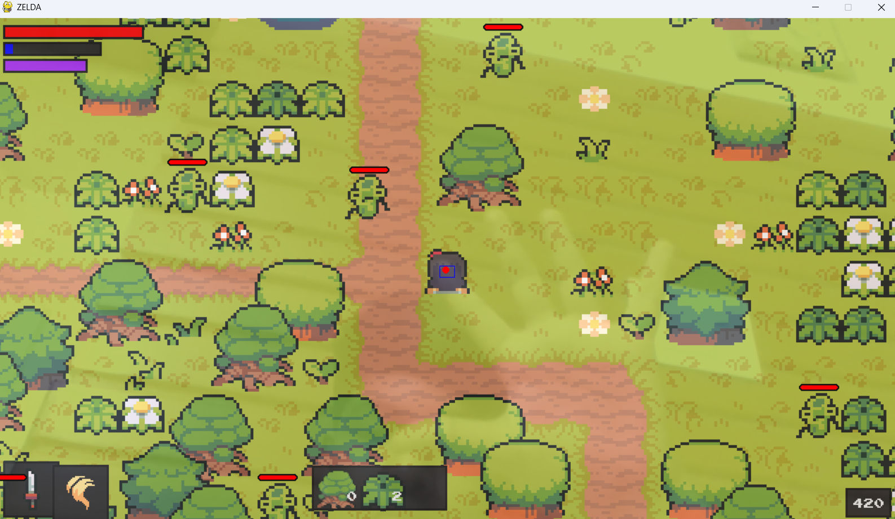

# What is this?

This is a zelda styled game created with pygame.
Movement of the player is done through hand control from camera

# Setup Process

If pyenv is not installed, open Powershell as administrator and execute

```
Set-ExecutionPolicy -ExecutionPolicy RemoteSigned -Scope LocalMachine
Invoke-WebRequest -UseBasicParsing -Uri "https://raw.githubusercontent.com/pyenv-win/pyenv-win/master/pyenv-win/install-pyenv-win.ps1" -OutFile "./install-pyenv-win.ps1"; &"./install-pyenv-win.ps1"
```

Link to download visual studio redistributable
https://learn.microsoft.com/en-us/cpp/windows/latest-supported-vc-redist

```
pyenv install 3.9.13
pyenv global 3.9.13
python -m venv .venv
.venv/Scripts/Activate.ps1
pip install pygame mediapipe opencv-python
python main.py
```

### Here's a pic of the game.



## Movement instructions

- Make a fist - lock movement
- Index finger up - Move
- Thumb finger out - Attack
- Index + Thumb finger out - Move + attack
- Open palm - Magic
